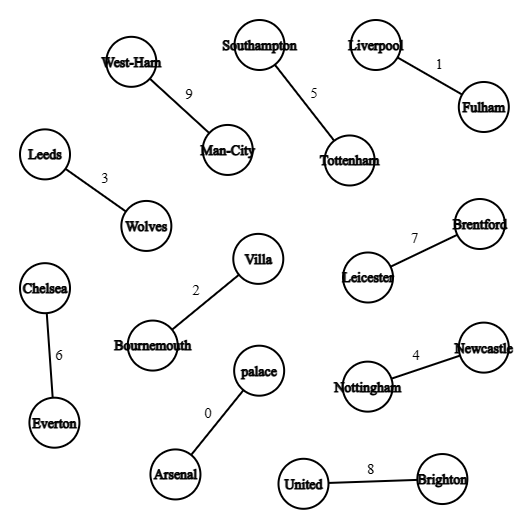
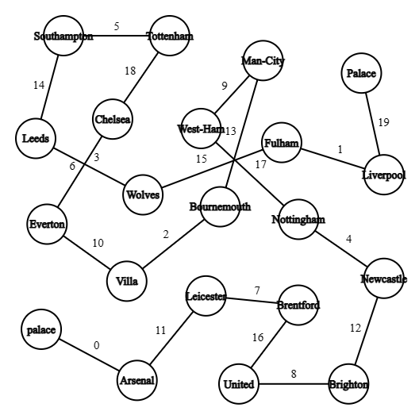
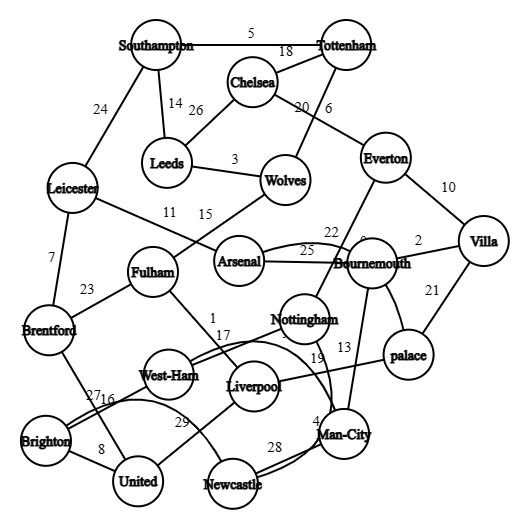
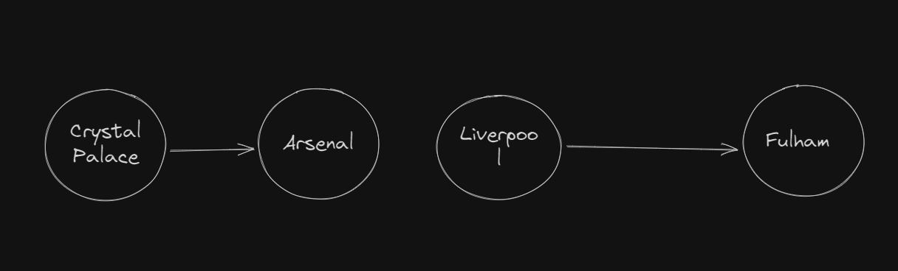

# Algorithm Analysis

# DFS

## Time Complexity

The program stores the given dataset in a graph data structure. The vertices represent the teams, and the Edges stores the match indices between the two connected vertices which are stored in an array. Then, it conducts a Depth-First Search (DFS) on the graph, by visiting all the edges (matches) from every Vertex to construct result in a hash table.

```
type teams_data = {
                    "name": string,
                    "match_played": number,
                    "w": number,
                    "d": number,
                    "l": number,
                    "gf": number,
                    "ga": number,
                    "gd": number,
                    "points": number
                }

```

Then, we sort the teams by their total_points.

Let Number of matches (rows in the csv file) = E

Let Number of teams = V

- Input:

$$
O(E)
$$

- DFS:

$$
O(E + V)
$$

- Sorting:

$$
O(V\log(V))
$$

$$
O(E+V * log(V))
$$
$$
O(E+Vlog(V))
$$

if number of rounds = X

$$
E = \frac{V}{2}* X
$$

$$
O(\frac{V.X}{2} + V\log(V))
$$

---

Graph visualization:

- Round 1



- Round 2



Round 3



The graph becomes increasingly complex as the number of rounds increases. In the second half of the league, the same teams will play again, the data is stored at the edge as an array of two indices representing the two matches played. 

---

## Space Complexity

The space complexity of the code can be analyzed based on the additional memory used by the data structures and variables during the execution of the program. Let's examine the main components:

- Graph and Match Data:
The code creates a NetworkX graph object (G) to represent the teams and their matches. The space required for storing the graph depends on the number of edges (matches) and nodes (teams). In the worst case, the graph can have O(E) edges and O(V) nodes. Additionally, the match data (matches list and teams_data dictionary) is stored in memory. Thus, the space complexity for the graph and match data is O(E + V).
- Teams Data:
The teams_data dictionary stores the statistics and information for each team. The dictionary size is proportional to the number of teams (V), with each team occupying a fixed amount of space for its data. Therefore, the space complexity for the teams_data dictionary is O(V).

# Topological sort

### Thought process:

if we represent each team as a vertex on a graph, and edges between those graphs are much losses and wins(loser points to winner), we can topologically sort those teams to get the standing based on wins/losses
Note that topological sort is O(V+E) so this solution is linear

For example if we have this data

```sql
1,Crystal Palace,Arsenal,0,2,A
1,,Fulham,Liverpool,2,0,H

```

Round 1:
the graph will look like this, where loser points to winner.

so with topological sort we get order like this

```sql
1- Arsenal
2- Fulham
3- crystal palace
4- liverpool
 

```



for now there’s no problems, but what about the **draw** condition, how to represent it while you represent the relation with directed graph in other words the edge has only three states A points to B or B points to A(note topological sort only works with DAG) or they both point to each other, if we choose the latter option this would create a cycle which is an issue we will discuss later, also it wouldn’t be accurate as of the current representation it means that A won once and B won once not that actually both got a draw.

the solution is to add virtual node to the graph where drawn teams points to it to indicate those teams have played and the match ended with draw

for example the next dataset

```sql
1,05/08/2022,Crystal Palace,Arsenal,0,2,A
1,06/08/2022,Fulham,Liverpool,2,2,D

```

the standing would be 

```sql
1- Arsenal
2- liverpool
3- Fulham
4- crystal palace
```


what about another solution?

use weighted graph where:

- if the weight is 3 for example means team won and team lost.
- if the weight is 1 for example means draw, and then we can handle this case to give both weight while sorting

this looks nice but it won’t last forever, let’s see the next dataset

In the premier league for example, the league is broken into two halves where each team face the other teams twice per league.

```sql
# first half Arsenal won
1,05/08/2022,Crystal Palace,Arsenal,0,2,A

# second half, crystal palace Won
28,05/08/2023,Arsenal, Crystal Palace,0,2,A

```

Oopsie Doopsie We’re not D~~A~~G anymore


Topological sort only works with acyclic graphs, so this algorithm would be perfect for something like tournaments where each team faces another exactly once(like round-robin tournament).
This problem won’t appear in any query where the round number is less than half total round numbers.

> feedback arc set could be the solution for this part
> 

### Compromise

We can still get the standing for two halves independently in two individual queries and merge them into one whole sorted array. but the merging step would be complicated since the teams would be duplicated in both arrays.

### Conclusion

further research could really make this algorithm a linear working one but as of now, the cyclic nature of the league is a determinant factor in this algorithm.

###
